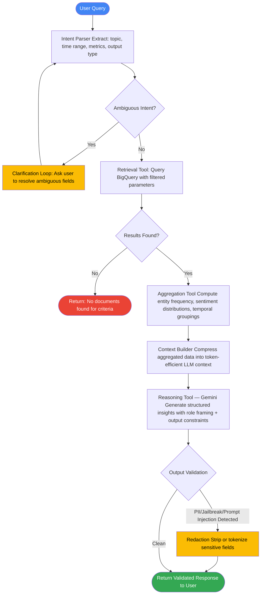
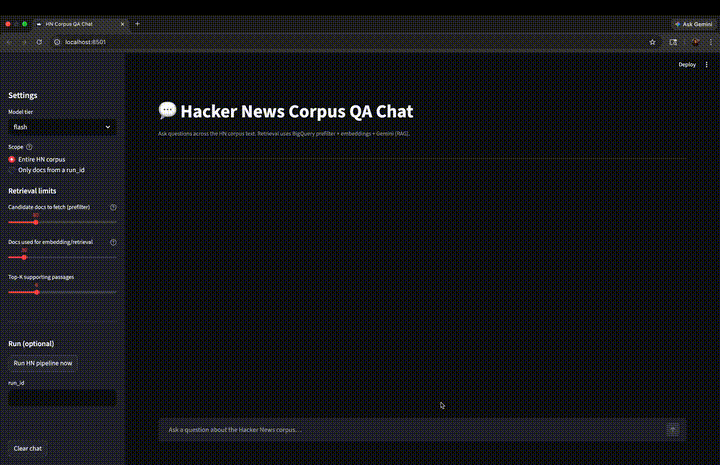

# 🤖 Agent Design Report

Our prototype implements a GCP-native NLP system that:
- Extracts entities, sentiment from text
- Generates abstractive summaries using generative AI
- Stores enriched outputs for downstream analytics

This core system can work as a foundation for:
- Use agentic reasoning for information summarization/extraction or
- RAG application for virtual assistants/chatbots etc.

The remainder of this report focuses on the agentic design, architectural strategy, and system-level considerations.

## Why Introduce Agents?
Single-document summarization is straightforward. Real-world enterprise value comes from:

- Cross-document synthesis
- Trend detection
- Strategic insight generation
- Multi-step analytical reasoning  
- Integration with external knowledge sources  

These require:

- Intent interpretation  
- Tool orchestration  
- Iterative reasoning  
- Structured memory access  

## Proposed Agents

### 1. Insight Aggregation Agent

**Objective:**  
Identify recurring themes and macro-level signals across document sets.

**Example Query:**  
“What are the dominant concerns across recent support tickets?”

**Required Capabilities:**
- BigQuery retrieval  
- Entity aggregation  
- Sentiment distribution analysis  
- Generative synthesis  

---

### 2. Research Assistant Agent

**Objective:**  
Provide structured analytical responses to strategic queries.

**Example Query:**  
“How has sentiment toward pricing evolved over the past quarter?”

**Required Capabilities:**
- Time-filtered retrieval  
- Structured statistical aggregation  
- Context compression  
- LLM-based interpretation  
- Optional web enrichment  

---

### 3. Document Triage Agent (Future Extension)

**Objective:**  
Automate classification, prioritization, and routing of incoming documents.

**Capabilities:**
- Entity-based categorization  
- Sentiment-based prioritization  
- Workflow routing  

---

## Agent Architectural Principles

### Infrastructure Example

| Layer                | GCP Service                                      | Purpose                          |
|----------------------|--------------------------------------------------|----------------------------------|
| API Layer            | Cloud Run, Pub/Sub                               |          Stateless backend API   |
| Agent Orchestration  | Vertex AI Agent Builder (or custom Python agent on Cloud Run) |  Tool orchestration |
| LLM                  | Gemini (Flash / Pro)                             | Synthesis & reasoning            |
| Structured Memory    | BigQuery                                         | Analytical document store        |
| Raw Storage          | Cloud Storage                                    | PDF storage                      |
| Vector Memory        | Vertex AI Vector Search                          | Semantic retrieval               |
| Session State        | Firestore                                        | Multi-turn context               |
| PII Detection        | Cloud DLP                                        | Redaction & tokenization         |
| Prompt injection and Jailbreak        | Custom/Open source models       | Redaction & tokenization         |
| Observability        | Cloud Logging & Monitoring                       | Metrics & auditability           |


### Implementation Roadmap

#### Phase 1 — Agent Layer
- Implement intent parser
- Register BigQuery retrieval tool
- Add deterministic aggregation module
- Add Gemini reasoning tool
- Add structured output validator
- Add clarification loop


#### Phase 2 — Production Hardening
- IAM-scoped service accounts
- Row-level security in BigQuery
- DLP redaction pipeline
- Prompt injection and Jailbreak detection
- Structured logging
- Cost monitoring
- Alerting

---

### Deterministic + Generative Separation

Structured data extraction is handled by deterministic APIs.  
Interpretation and synthesis are handled by generative models.

This hybrid architecture reduces hallucination risk and increases schema reliability.

---

### Stateless Reasoning, Persistent Memory

- LLM reasoning remains stateless.
- BigQuery serves as durable analytical memory.
- Optional session state can be layered using Firestore or Memorystore.

---

### Retrieval Before Reasoning

The LLM receives compressed, aggregated context rather than raw text. 

This improves:

- Cost efficiency  
- Reliability  
- Interpretability  
- Safety  

---

### Optimizations 

- Flash model for extraction tasks
- Pro model only for high-level synthesis
- Structured aggregation before LLM
- Token compression
- Retrieval row limits

---

## Agent Workflow Strategy

Here is a sample agent that executes a structured reasoning loop:

### Step 1 - Intent Parsing
Extract:
- Topic  
- Time constraints  
- Metrics  
- Output expectations  

### Step 2 - Retrieval
Query BigQuery for relevant document subsets.

### Step 3 - Structured Aggregation
Compute:
- Entity frequency  
- Sentiment distributions  
- Temporal groupings  

### Step 4 - Context Construction
Assemble structured analytical context for LLM input.

### Step 5 - Generative Synthesis
Gemini produces:
- Insights  
- Thematic clustering  
- Strategic interpretation  

---

## Agent Reasoning

The diagram below illustrates the full agent reasoning loop, including the ambiguity handling branch and the output validation step before returning results to the user.



### Pseudocode 
The following pseudocode shows how the agent chains tools, handles ambiguous queries mid-loop, and manages state through the reasoning cycle. The task used in this exmaple is **Cross-Document Summarization**.

```python
def summarize_across_documents(user_query: str, session_id: str | None = None) -> dict:
    """
    Agentic workflow: cross-document summarization.
    Produces one synthesized summary across a retrieved document set.
    """

    # 1) Parse intent: topic + time range + desired summary style
    intent = vertex_ai_llm.parse_intent(
        model="gemini-1.5-flash",
        query=user_query,
        schema={
            "topic": "string",
            "time_range_days": "int|optional",
            "summary_style": "bullet|narrative",
            "focus": "what to emphasize"
        }
    )

    # Clarify if critical fields are missing
    if intent.is_ambiguous():
        clarification = request_user_clarification(intent.missing_fields)
        intent = vertex_ai_llm.refine_intent(intent, clarification)

    # 2) Retrieve candidate documents (BigQuery metadata + extracted fields)
    # Pull doc_id, title, timestamp, per-doc summary, top entities, sentiment, and/or key excerpts.
    docs = bigquery_client.query(
        sql=build_docset_sql(topic=intent.topic, days=intent.time_range_days),
        max_rows=200  # cost + latency guardrail
    )

    if not docs:
        return {"message": "No documents found matching the criteria."}

    # 3) Select the most relevant evidence across the doc set
    # Option A: deterministic ranking using entity overlap / recency / keyword match
    ranked = doc_ranker.rank(docs, query=user_query, top_k=30)

    # Option B: semantic rerank using embeddings + Vertex AI Vector Search
    # ranked = vector_search.rerank(ranked, query=user_query, top_k=30)

    # 4) Build cross-document context (compressed)
    # Provide the LLM with doc-level summaries/excerpts + doc_ids for citation.
    context = context_builder.build_cross_doc_context(
        ranked_docs=ranked,
        fields=["doc_id", "title", "timestamp", "summary", "key_excerpts", "entities", "sentiment"],
        max_tokens=6000
    )

    # 5) Synthesize ONE summary across all selected documents
    # The output must explicitly reflect cross-doc themes and differences.
    cross_doc_summary = vertex_ai_llm.generate(
        model="gemini-1.5-pro",
        system_instructions=(
            "You are an analyst summarizing themes across multiple documents. "
            "Do not summarize documents one-by-one. "
            "Identify recurring themes, disagreements, and notable outliers. "
            "Only use the provided context."
        ),
        input_context=context,
        output_schema={
            "summary": "string",
            "key_themes": "list[string]",
            "notable_outliers": "list[string]",
            "top_sources": "list[doc_id]"  # citations
        }
    )

    # 6) Safety: redact PII if present
    if cloud_dlp.contains_pii(cross_doc_summary):
        cross_doc_summary = cloud_dlp.redact(cross_doc_summary)

    # 7) Persist session state (optional)
    if session_id:
        firestore_client.store(session_id, {"intent": intent, "result": cross_doc_summary})

    return cross_doc_summary

```
### Key design decisions

- Clarification loop is bounded — capped at 2 attempts to avoid infinite loops, with graceful fallback to defaults.
- Retrieval is capped — a max_results guardrail prevents runaway BigQuery costs on broad queries.
- Aggregation is deterministic — no LLM is involved before Step 6, reducing hallucination surface area.
- Context is compressed — the LLM never sees raw documents, only structured aggregated output.
- Detecting prompt injection and jailbreak for system safety
- PII redaction is post-generation — Cloud DLP acts as a safety net even if upstream redaction was applied.
- Session state is optional — supports both single-turn and multi-turn workflows without coupling.

---

## Memory Architecture

### Long-Term Memory
**BigQuery**
- Structured analytical store  
- Trend analysis capability  
- Retrieval substrate  

### Session Memory
**Firestore / Memorystore**
- Conversation state  
- Clarification steps  
- Multi-turn workflows  

### Semantic Memory
**Vertex AI Vector Search**
- Embedding-based retrieval  
- Fuzzy or intent-based matching  

---

# 8. Prompting Strategy

### Structured Context Injection
The LLM receives:
- Aggregated statistics  
- Entity rankings  
- Sentiment summaries  

Not raw text.

### Role Framing
Explicit analytical role definitions improve output consistency.

### Output Constraints
- Bullet-structured insights  
- Clear separation of observation vs interpretation  
- Controlled formatting  

### Guardrails
Explicit instructions to avoid inference beyond provided context.

---

## Monitoring & Observability

### API-Level Monitoring
- Tool latency  
- Error rates  
- Token consumption  

### Reasoning Monitoring
- Prompt logging  
- Context size tracking  
- Output validation  

### Data Quality Monitoring
- Entity consistency  
- Drift detection  
- Null/empty result tracking  

**GCP Services:**
- Cloud Logging  
- Cloud Monitoring  
- BigQuery audit logs  

---

## Agent Implementation Strategy

### Agent Layer: Vertex AI Agent Builder

Since our focus is on GCP native solutions, Vertex AI Agent Builder would be an ideal candidate.

This provides:

- Managed lifecycle control  
- Integrated Gemini models  
- Tool registration and governance  
- IAM-based access control  
- Centralized observability  

Each capability (retrieval, aggregation, summarization) would be registered as a controlled tool. The LLM would dynamically select tools based on intent.

---

### Experimentation

We could benchmark other agent orchestration tools like Langgraph and benchmark against Vertex AI Agent Builder. The efficacy of these tools largely depend on the nature of the task at hand.

---

## Key Challenges

### Hallucination Risk  
Mitigated through structured aggregation prior to LLM invocation.

- Strucured LLM output
- Advanced prompting techniques like CoT, ReAct
- Role framing: Give detailed description of each tools in prompt
- Always include link to the citations
- Retrieve results based on model's confidence score

### Cost Control  
Managed via:
- Model selection (Flash vs Pro)  
- Context compression  

### Ambiguous Queries  
Addressed through intent parsing and clarification loops.

---

## Security, Privacy, and Safety Considerations

Agentic systems expand the attack surface compared to single-model inference because they can 

-   a. call tools
-   b. retrieve data from stores, and
-   c. incorporate external/untrusted content. 

Below are the core risks and mitigations considered for a production-grade GCP-native deployment.


### Primary Risks

- Unauthorized tool invocation (agent uses powerful tools beyond intended scope)
- Data exfiltration (agent leaks sensitive data from BigQuery, documents, or connectors)
- Prompt injection (malicious document content influences agent instructions)
- Jailbreak attempts (user tries to override system policy and guardrails)
- PII leakage (summaries or insights expose sensitive identifiers)
- Supply chain risks (external web sources, untrusted content, third-party APIs)


### Mitigations

#### 1. Principle of least privilege (IAM):
-   Use dedicated service accounts for the agent and for each tool class (read-only retrieval vs write operations).
-   Restrict BigQuery access to authorized datasets/tables/views only.

#### 2. Tool allow-listing and scoped permissions:
-   Maintain a strict registry of approved tools and disallow arbitrary tool calls.
-   Scope tools to minimal functions (e.g., query_documents_readonly vs query_documents_admin).

#### 3. Row/column level security:
-   Use BigQuery authorized views to restrict access to sensitive columns by default (PII fields never returned to the agent).

#### 4. Auditing:
-   Log every tool call with: tool name, parameters (redacted), document ids accessed, timestamp, and model used.
-   Use BigQuery audit logs + Cloud Logging for traceability.
-   GCP-native note: Vertex AI Agent Builder is well-aligned with enterprise tool governance because tools can be curated/controlled and tied into IAM and logging in a managed pattern.
-   Require the model to justify tool use with structured intent (e.g., “reason_for_tool_call”) and validate this programmatically.

#### 5. PII detection and redaction:
-   Run PII detection prior to storage or prior to LLM calls.
-   Use Cloud DLP API for robust detection and tokenization/redaction before indexing or summarization.

#### 6. Prompt Injection and Malicious Content:
-   Use models to detect these

#### 7. Output constraints + schema validation:
-   Force model output into structured formats and validate fields.
-   Block outputs that contain PII patterns unless explicitly authorized.

#### 8. Data Exfiltration and External Web Tools: Web enrichment tools can leak internal context if the agent includes sensitive content in a search query or HTTP request.

-   Query redaction: Strip sensitive strings from any outbound web queries.
-   Restrict web access to a curated list of trusted sources where possible.
-   Never send raw documents to external tools; only send the minimal query terms required.
-   Rate limiting and circuit breakers:

---
## Monitoring

In addition to standard observability, security monitoring should include:
- Alerts on unusual tool usage patterns (high volume, unexpected tools)
- Alerts on repeated blocked jailbreak attempts
- Alerts on anomalous BigQuery access patterns
- Regular review of logs for potential data leakage

---
## Evaluation

#### Human-in-the-loop for sensitive workflows: For workflows that access sensitive data or external systems, require review/approval.

#### Offline benchmark dataset: Create an offline benchmark dataset for detailed evaluation


## Demo

Below is a short demo showcasing how agentic capabilities enhance the system.  
The implementation uses custom agentic orchestration logic and BigQuery for storage and retrieval. The code is at nasant stage and hence not available in the repo.

[](assets/agent_demo_1.5x.mp4)