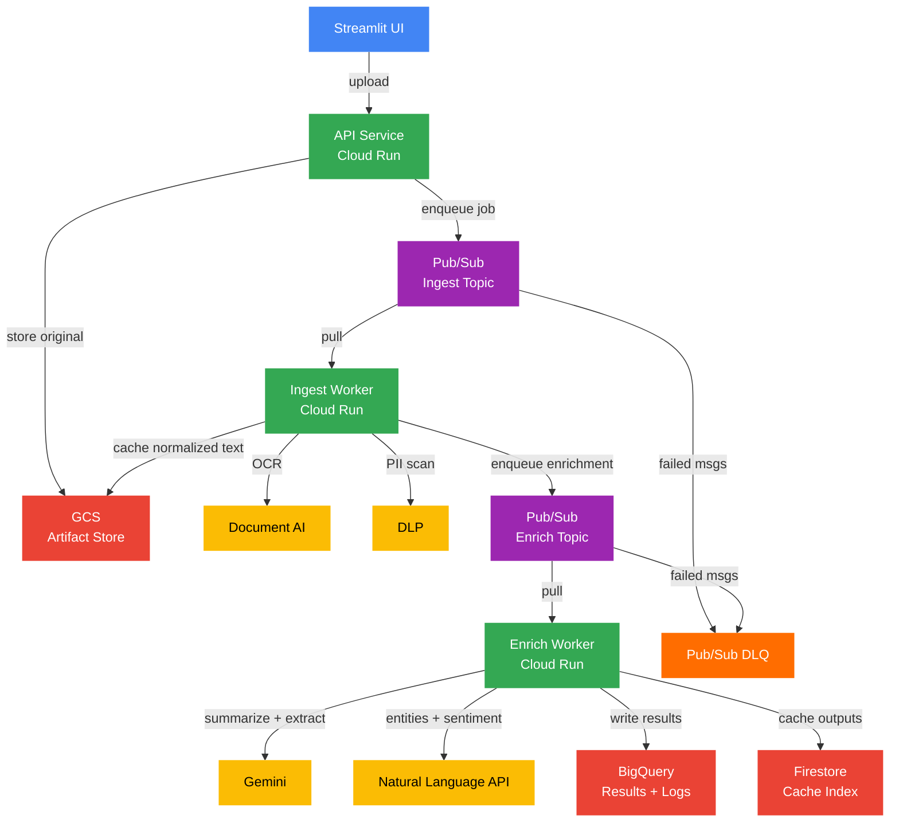
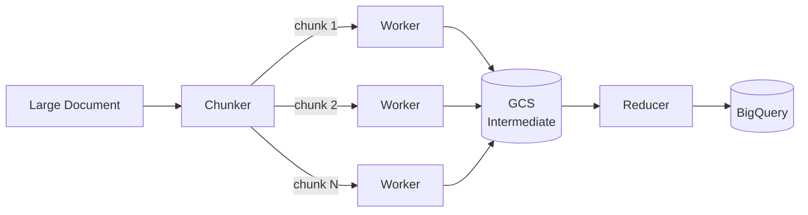
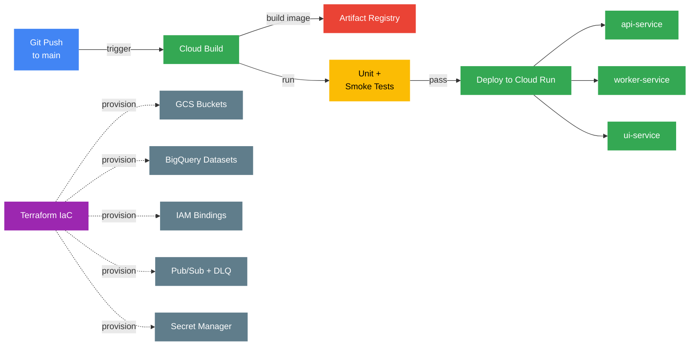

# 📦 Future Production Scope and Improvements

This prototype demonstrates a production-structured baseline: 
- FastAPI backend (Cloud Run) orchestrates document ingestion (PDF via Document AI), 
- Enrichment (Gemini + Natural Language API), 
- Privacy scanning (DLP), 
- Persistence (GCS + BigQuery),
- Lightweight Streamlit UI for interaction and visualization. 

To productionize for real-world deployment, the system would evolve into an event-driven, scalable pipeline with stronger security controls, observability, cost governance, and CI/CD.

---

## 1. Scalable Orchestration and System Architecture

### Current (Prototype) Architecture

The prototype follows a synchronous, request-driven flow:

- Streamlit UI triggers processing (HN run / PDF upload)
- Cloud Run API performs synchronous orchestration
- GCS stores uploaded PDFs
- Document AI extracts text from PDFs
- DLP scans extracted text for PII
- Gemini generates summaries and structured extraction
- Natural Language API generates entities and sentiment
- BigQuery stores processed results and run logs
- Basic caching exists at the processed-result level (content-hash doc key) - stored in BigQuery

### Production Target Architecture (Asynchronous, Event-Driven)

The production system moves from "synchronous request → full processing" to "request → enqueue → async workers," so the system scales and stays responsive under large volumes and long-running jobs.

**Recommended GCP-native orchestration options** (choose based on complexity):

| Option | Best For |
|---|---|
| Pub/Sub + Cloud Run workers | Simple, scalable, cost-effective default |
| Cloud Workflows | Orchestration with retries and branching logic |
| Vertex AI Pipelines | ML ops conventions, pipeline lineage, artifact tracking |
| Cloud Tasks | Rate-limited per-doc processing; avoids model quota bursts |
| Cloud Run Jobs | Batch/backfill runs (e.g., nightly reprocessing, large datasets) |

**Why this improves production readiness:**

- Pub/Sub buffers bursts; workers autoscale to handle spikes
- UI stays responsive — users don't wait for long processing jobs
- Easier retries and dead-letter queues (DLQ)
- Clear separation of ingest vs. enrich stages

---

## 2. Handling Different File Types

In production, ingestion should support a variety of formats:

| Format | Processing Approach |
|---|---|
| PDF | Document AI OCR / PDF parser |
| Images (PNG/JPG) | Document AI OCR or Vision API |
| DOCX/PPTX | Cloud Run converter (LibreOffice) → text |
| XLSX/CSV | Extract cell text and metadata per sheet |
| HTML/URLs | Fetch + boilerplate removal → text |

**Design approach:** Detect file type at ingest using content-type and magic bytes, then normalize all formats into a common intermediate structure — `NormalizedDocument { text, metadata, pages/sheets, provenance }`. Store the original artifact in GCS and the normalized text in BigQuery/GCS for reuse.

---

## 3. Very Large Files and High-Volume Processing

### Chunking Strategy

- Split by page or section with overlapping windows, preferring semantic boundaries
- Introduce semantic chunking in-case of downstream RAG
- Bound each chunk by model token limits
- Summarize per chunk, then use each summary to generate overall summary (map-reduce pattern)
- Persist intermediate summaries to avoid recompute and enable partial retries

### Asynchronous Batching

For very large documents, fan out one Pub/Sub task per chunk, then fan in with a reducer task. Use message attributes `{ doc_id, chunk_id, stage }` to track state across workers.

### Operational Safeguards

- **Hard limits:** Reject files above a max size, or route them to an offline batch path
- **Timeouts:** Enforce per-stage timeouts with retries
- **Partial completion:** Store intermediate outputs so processing can resume on failure

---

## 4. Caching and Reuse

The prototype uses a content-hash doc key and BigQuery cache table as a starting point. Production caching expands into two layers:

**Ingest cache** — avoids repeating expensive OCR and DLP runs. Cache extracted text keyed by `gcs_uri + generation` or file hash.

**Enrichment cache** — avoids repeated LLM costs for identical content. Cache summaries and extraction outputs keyed by `content_hash + model_tier + prompt_version + pipeline_version`.

**Recommended storage by use case:**

| Store | Use |
|---|---|
| Firestore | Cache index and job state (fast key-value lookups) |
| Memorystore (Redis) | Hot cache with TTL for lowest latency |
| GCS | Large cached artifacts (OCR text, chunk outputs) |
| BigQuery | Final outputs, analytics, historical logs |

Ideally we would use a combination of these:
- Firestore = best cache index (fast lookup, low ops)
- GCS = store the large cached outputs as JSON blobs in GCS
- BigQuery = for analytics, not cache
- Memorystore = when very high QPS, lots of repeated lookups

---

## 5. Cloud Run Scaling and Performance

**Configuration guidance:**

- **Concurrency:** Start with 10–40 for I/O-heavy workloads (Gemini/DocAI latency dominates)
- **Min instances:** Set to 1–2 to reduce cold starts where latency matters
- **Max instances:** Cap to control cost and avoid API quota bursts
- **CPU allocation:** Use "CPU always allocated" for heavy parsing or OCR post-processing

**Separate services by concern:**

- `api-service` — lightweight request routing
- `worker-service` — processing and autoscaling
- `ui-service` — Streamlit frontend

**Quota and rate protection:** Use Cloud Tasks or a Pub/Sub pull pattern to pace calls to Gemini and Document AI, avoiding throttling.

---

## 6. Security and Data Privacy

### IAM and Access Control

Use least-privilege service accounts with clear role separation:

- `api-sa` — write job requests, read results
- `worker-sa` — DocAI, DLP, Gemini, BigQuery write, GCS read/write
- `ui-sa` — read-only results (optionally behind IAP)

### Data Encryption

GCS and BigQuery are encrypted at rest by default. For sensitive deployments, additionally use:

- CMEK (Customer-Managed Encryption Keys) for GCS and BigQuery
- Secret Manager for API keys and config (not stored in code)
- VPC Service Controls to reduce data exfiltration risk

### Privacy and PII Handling

DLP inspection already exists in the pipeline. Production enhancements include:

- Optionally redact or tokenize PII before sending to the LLM
- Store PII findings separately with strict IAM controls
- Add retention policies (TTL) on raw text where required

**Current state:**
- ✅ DLP inspection exists
- ✅ GCS + BigQuery encryption at rest
- ⚠️ Needs: service account separation, Secret Manager integration, removal of local key artifacts from repo

### Detecting Prompt Injection and Jailbreak

We could use pre-trained models, or build custom models for detecting prompt injection or jailbreak in the text. This add an added layer f advanced data protection.

---

## 7. Monitoring, Logging, and Error Handling

### Structured Logging

Emit structured JSON logs from API and workers containing: `run_id`, `doc_id`, `stage`, `latency_ms`, `status`, `error_message`. Export to Cloud Logging for ops and BigQuery for analytics.

### Metrics to Track

- Cloud Run: request count, p95 latency, CPU/memory, instance count
- Custom: per-stage latency (DocAI, DLP, Gemini), cache hit rate, token and cost estimates per run

### Alerting and Error Handling

- Cloud Error Reporting for exceptions
- Alert policies for: failure rate above threshold, Pub/Sub backlog too large, p95 latency too high
- Pub/Sub DLQ for poison messages with replay tooling

---

## 8. Cost Management and Optimization

**Key cost drivers:** Document AI OCR (per page), DLP inspection, Gemini tokens (prompt + output), Cloud Run compute, BigQuery query and storage growth.

**Optimizations:**

- **Model tier selection:** Use Flash vs. Pro based on document size or user preference
- **Token control:** Clip input, chunk intelligently, reduce prompt verbosity, enforce strict max output tokens
- **Caching:** Ingest cache avoids OCR/DLP repeats; cache avoids LLM repeats
- **Budget controls:** GCP Budgets with spend alerts; quota and max instance limits
- **Batch backfills:** Run via Cloud Run Jobs off-hours to minimize compute costs

---

## 9. CI/CD, Reproducibility, and Infrastructure as Code

### CI/CD Pipeline (Cloud Build)

On merge to main: build container → push to Artifact Registry → deploy to Cloud Run → run unit and smoke tests.

### Reproducibility

- Pin dependencies (uv lockfile / requirements)
- Containerize all services (api / ui / worker)

### Coding Best Practises
- Add detailed pytests for
- Add linting and formatting (ruff / black)
- Type check and schema enforcing
- Add GitHub Actions or Cloud Build steps to check above during deployement
- Structured and standardized logging and error handling

### Infrastructure as Code (Terraform)

Manage: GCS buckets, BigQuery datasets and tables, IAM bindings, Pub/Sub topics and subscriptions with DLQ, Cloud Run services with min/max instance config, Secret Manager secrets and access policies.

---

## 10. Evaluation and Quality Gates

### Offline Evaluation

Maintain a sanitized evaluation dataset and track: summary completeness (ends with punctuation, length bounds), schema validity for structured extraction, PII recall (DLP-based checks), and drift in entity/topic distributions for HN data.

### Production Gating

- Enforce JSON schema validation for extraction outputs
- Reject or flag low-confidence outputs
- Optional: human review workflow for sensitive documents

---

## 11. Continued Experimentation ❗❗
Need to perform extensive experiementation:  
1. Accuracy, latency and cost of some of the open source models with GCP services
2. Compare Spacy, Presidio, distilbert models vs Google's NL API and Cloud DLP for entities and PII
3. Use CoNLL-2003 and OntoNotes 5.0 datasets as gold standard for comparison
4. If user expects custom entity, we can train models for that
5. Explore Document AI Summarizer tool and see how that compares to Document AI+Gemini call.

## Summary

| Area | Evolution |
|---|---|
| Architecture | Synchronous prototype → async event-driven pipeline (Pub/Sub + workers) |
| Ingestion | PDF only → multi-format |
| Large docs | Single pass → fan-out/fan-in chunk processing |
| Caching | BigQuery hash cache → multi-layer (Firestore / Redis / GCS artifacts) |
| Security | Basic → least-privilege IAM, Secret Manager, optional CMEK/VPC-SC |
| Observability | Minimal → structured logging, monitoring, DLQ, alerting |
| Delivery | Manual → CI/CD with Cloud Build, Artifact Registry, and Terraform IaC |
