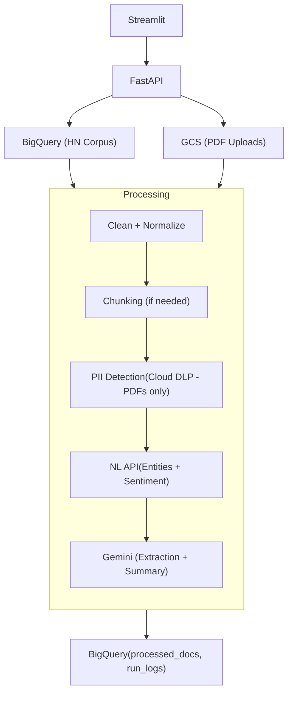
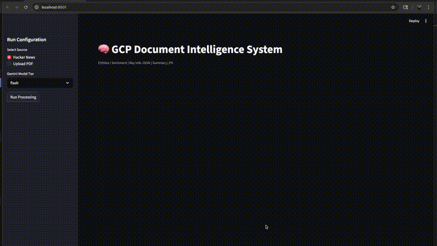

<div align="center">

# 🧠 GCP Document Intelligence System


</div>

An NLP system that extracts structured information and generates summaries from:

- **Hacker News corpus** (BigQuery Public Dataset)
- **User-uploaded PDFs** (GCS + Document AI)

The system is deployed on **Google Cloud Run** and leverages:

- **Vertex AI** (Gemini Flash/Pro) for structured extraction & summarization
- **Natural Language API** for entity + sentiment analysis
- **Cloud DLP** for PII detection (for user uploaded PDFs)
- **Document AI** for OCR
- **BigQuery** for corpus storage, caching, and observability
- **Streamlit UI** for interactive usage



---

## Demo
Here is a working demo of the prototype. 

[](assets/demo_3x.mp4)

[▶ Download full video here](assets/demo_1.5x.mp4)

---

## Features

| Feature | Status |
|---|---|
| Multi-source input (Hacker News + PDF upload) | ✅ |
| Per-document entity extraction | ✅ |
| Sentiment analysis | ✅ |
| Structured key information extraction (JSON) | ✅ |
| Human-readable summaries | ✅ |
| Context-aware chunking (map-reduce) | ✅ |
| PII detection for PDFs (Cloud DLP) | ✅ |
| Model selection (Gemini Flash / Pro) | ✅ |
| BigQuery-based caching | ✅ |
| Basic cost + latency monitoring | ✅ |
| Cloud Run deployment ready | ✅ |
| Unit tests with pytest | ✅ |


## Why BigQuery for Storage, Analytics & Cache
- Already integrated
- Cheap compared to LLM calls
- Partitioned for efficiency
- Idempotent processing via cache keys
- Switch to Firestore for future production scope

## Why Separate Extraction & Summary Calls
- Better JSON validation
- Lower hallucination risk
- Cleaner failure handling

## Why Context-Aware Chunking
- Prevents context overflow
- Reserves space for prompts and output
- Map-reduce ensures full-document summarization

Please note that this feature is not yet tested on an actual docuemnt.

## Cloud Run Compatible
- Simpler architecture
- Lower operational complexity
- Still horizontally scalable
- Pub/Sub for future production scope

The service is containerized with Docker and designed to run on Cloud Run. The final steps of deployment coudl be done during the next phase.
---

## Data Sources

### 1. Hacker News (BigQuery Public Dataset)

**Source:** `bigquery-public-data.hacker_news.full`

Materialized subset into: `project.dataset.hn_corpus`

**Columns used:** `id`, `title`, `text`, `score`, `by`, `timestamp`

### 2. PDF Upload
- Uploaded to private GCS bucket
- Processed with Document AI OCR and Cloud DLP inspection

---

## Processing Flow

### Hacker News Flow
1. User selects N documents
2. Fetch subset from BigQuery
3. Normalize into Document schema
4. Strip HTML
5. Chunk if needed
6. Natural Language API → entities + sentiment
7. Gemini extraction → structured JSON
8. Gemini summary → human-readable text
9. Store results + logs
10. Display in UI

### PDF Upload Flow
1. Upload PDF
2. Store in GCS
3. Extract text via Document AI
4. Detect PII via Cloud DLP
5. Optional redaction
6. Chunk if needed
7. NL API + Gemini
8. Store results + logs
9. Display summary + PII findings

### BigQuery Schema
All BigQuery tables are defined in ``infra/bigquery/``

---

## Prompting Strategy

### Structured Extraction Prompt
- Temperature: `0.1`
- Explicit JSON schema
- "Return ONLY valid JSON"
- Pydantic validation
- One repair retry if invalid

### Summary Prompt
- Temperature: `0.2`
- 3–5 concise sentences
- No speculation
- Focus on key facts

> No ReAct or Chain-of-Thought used (not required for this pipeline).

---

## Chunking Strategy
- Context-aware budget
- Reserved tokens for: system prompt, schema, expected output
- Chunk size: ~4–6k characters
- Overlap: ~300 characters
- Map-reduce summarization for large docs

---

## Cost Management Strategy

### BigQuery
- Select only required columns
- Use `LIMIT`
- Partition tables
- Set maximum bytes billed

### Gemini
- Flash as default
- Pro optional
- Token logging
- Char-based estimates

### PDF Controls
- `MAX_PDF_SIZE_MB`
- `MAX_CHARS_PER_DOC`
- `MAX_DOCS_PER_RUN`

---

## Monitoring & Observability

The prototype foundational work for cost and token monitoring which is stored in BigQuery. The cost calculation logic is still *WIP*.

### Logging Plan per Document
| Metric | Description |
|---|---|
| `fetch_ms` | Fetch latency |
| `ocr_ms` | OCR latency |
| `dlp_ms` | DLP inspection latency |
| `clean_ms` | Cleaning latency |
| `chunk_ms` | Chunking latency |
| `nl_ms` | Natural Language API latency |
| `llm_extract_ms` | LLM extraction latency |
| `llm_summary_ms` | LLM summary latency |
| `total_ms` | Total latency |
| `input_chars` / `output_chars` | Character counts |
| `token estimates` | Token usage |
| `model_used` | Model identifier |
| `status` | Processing status |

### BigQuery Tables
- `runs`
- `processed_docs`
- `run_logs`

### UI Displays
- Summary
- Entities
- Sentiment
- PII detected
- Time per step

---

## Baseline Comparison ❗❗

Baseline comparison is absent in the prototype as it involves more detailed experiementation:  
1. Accuracy, latency and cost comparison between open source models and GCP services
2. Compare ``Spacy, Presidio, pre-trained bert based models`` vs Google's NL API and Cloud DLP for entities and PII 
3. Use ``CoNLL-2003 and OntoNotes 5.0 datasets`` as gold standard for comparison
4. Compare ``TextRank, open source Mistral`` with Gemini for summarization task.

---

## Security Considerations
- Least privilege service accounts
- Private GCS bucket
- No raw PII logged
- Encryption at rest (GCP default)
- JSON schema validation
- File size restrictions

---

## Error Handling
- Structured API error responses
- Pydantic validation
- One retry for invalid JSON
- Graceful file size errors
- Clear UI messaging

---

## Testing

Run tests:

```bash
uv run pytest
```

Tests for:

- HTML cleaning
- Chunking
- Prompt builder
- Pydantic validation
- Mocked LLM response

---

## Setup Instructions

### Using `uv` (Primary)

```bash
uv sync
uv run uvicorn app.main:app --reload
```

**requirements.txt** is also included.

Generated via:

```bash
uv pip freeze > requirements.txt
```

---

## GCP Setup

**Enable APIs:**
- BigQuery
- Vertex AI
- Natural Language API
- Document AI
- Cloud DLP
- Cloud Storage

**Create service account and assign roles:**
- BigQuery User
- Vertex AI User
- Document AI User
- DLP User
- Storage Object Admin

---

## Streamlit UI

The Streamlit UI is a lightweight frontend for running the pipeline and viewing results. 

---

## Run Locally (UI + API)

**Terminal 1 - start API**

```bash
uv run uvicorn app.main:app --reload --port 8000
```

**Terminal 2 - start UI**

```bash
export API_BASE_URL="http://localhost:8000"
uv run streamlit run ui/streamlit_app.py
```

Open: [http://localhost:8501](http://localhost:8501)

---

## Cloud Run Compatible

The app is containerised using `Docker`. The image is ready to be built and pushed via Cloud Build, then deployed to Cloud Run using the below:

```bash
gcloud builds submit --tag gcr.io/PROJECT_ID/app

gcloud run deploy app \
  --image gcr.io/PROJECT_ID/app \
  --platform managed \
  --region us-west1 \
  --allow-unauthenticated \
  --memory 2Gi \
  --timeout 900
```

This command could be run during the next phase.

---

## Known Limitations
- Baseline comparison is absent
- Cloud run compatible, yet to be deployed
- PDF only (future production scope)
- English-only assumption
- No async job queue (future production scope)
- Only basic logging and monitoring
- Limited file type support
- Basic prompting, need to implement hardened system-user prompting.
- Yet to implement linting and formatting
- No multi-step conversation (chat like interface)
- BigQuery tables were provisioned manually via the console (no version-control Makefile or Infrastructure as Code such as Terraform) 
- Yet to test chunking strategy implemented for large doc with context window exceeding.

## Production Scope
While this protoype has production-structured baseline, there is a far bigger territory to cover in terms of production scope. For more details, see the report - [Future Production Scope and Improvements.md](./Future%20Production%20Scope%20and%20Improvements.md)

---

## Adding Agentic Capabilities
Adding agentic capablities to this summarization project will take this task to the next level. For more details, see the report - [Agentic System Design.md](./Agentic%20System%20Design.md)

## 📄 License

*For evaluation purposes only.*
